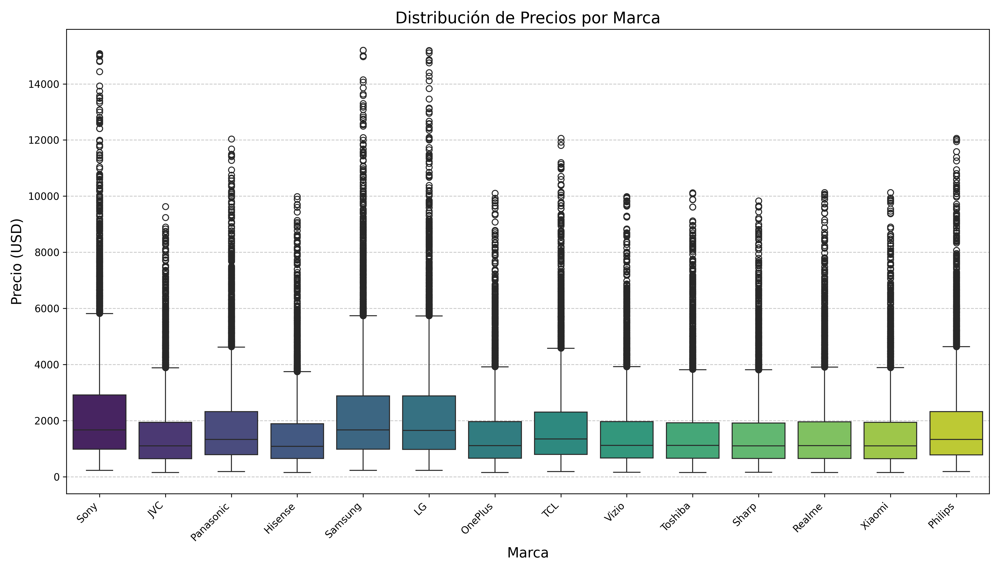
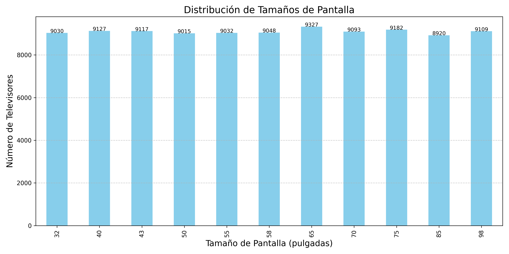
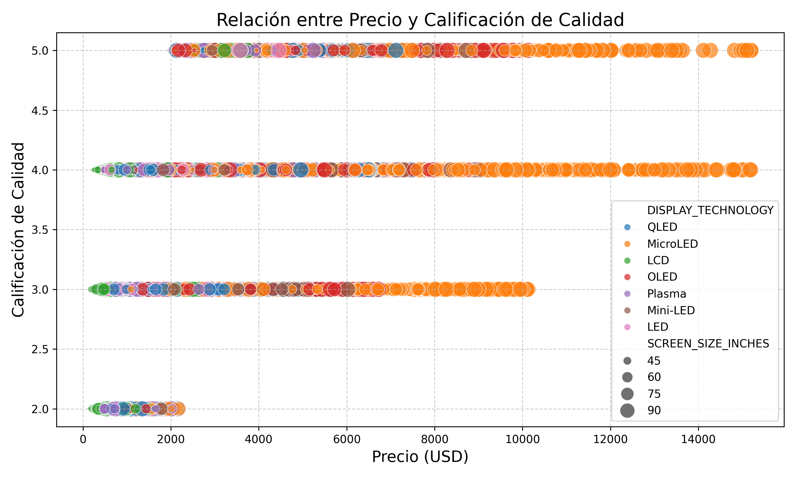
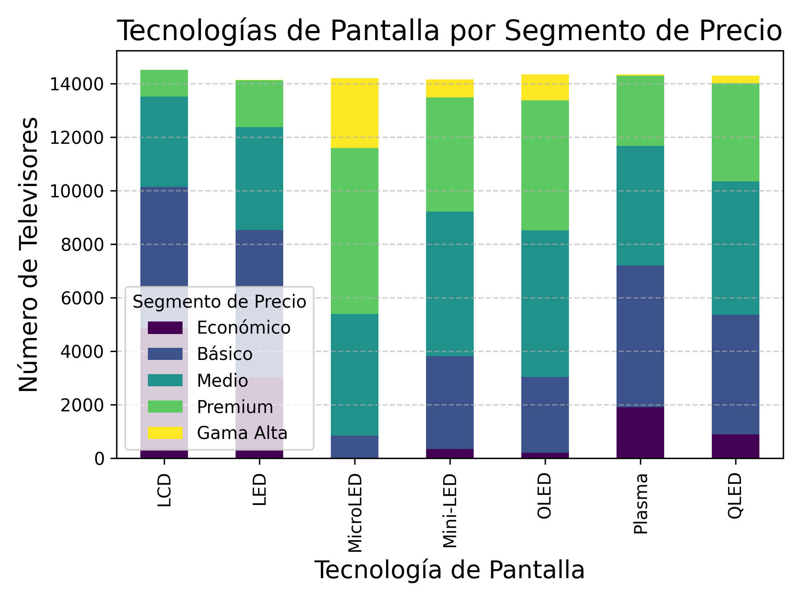
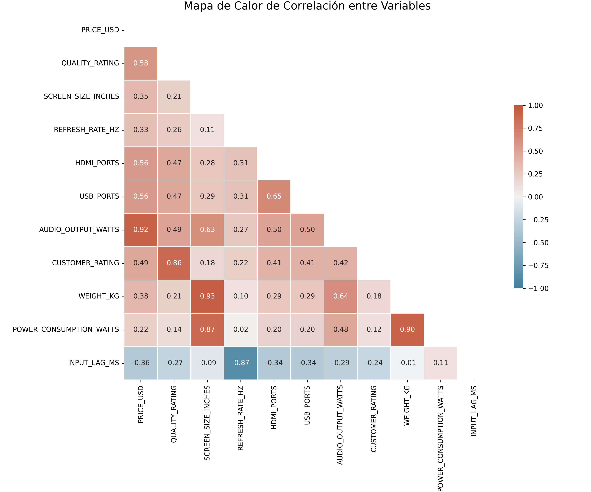

# 📺 Television Data Generator

<div align="center">


**Generate realistic synthetic datasets for televisions with customizable features**

</div>

## 📋 Table of Contents
- [📺 Television Data Generator](#-television-data-generator)
  - [📋 Table of Contents](#-table-of-contents)
  - [🔍 Overview](#-overview)
  - [✨ Features](#-features)
  - [🚀 Installation](#-installation)
  - [💻 Usage](#-usage)
    - [Run the Main Script](#run-the-main-script)
    - [Use as a Module](#use-as-a-module)
  - [📊 Generated Columns](#-generated-columns)
  - [📈 Visualizations](#-visualizations)
    - [1. Distribución de Precios por Marca](#1-distribución-de-precios-por-marca)
    - [2. Distribución de Tamaños de Pantalla](#2-distribución-de-tamaños-de-pantalla)
    - [3. Relación entre Precio y Calificación de Calidad](#3-relación-entre-precio-y-calificación-de-calidad)
    - [4. Tecnologías de Pantalla por Segmento de Precio](#4-tecnologías-de-pantalla-por-segmento-de-precio)
    - [5. Mapa de Calor de Correlación](#5-mapa-de-calor-de-correlación)
  - [🧪 Testing](#-testing)
  - [👤 Author](#-author)
  - [📄 License](#-license)

## 🔍 Overview

This project generates synthetic datasets for televisions, including attributes like brand, price, screen size, and quality ratings. Designed for data analysis, visualization, and machine learning, it produces realistic data with customizable row counts and export formats (CSV, JSON, Excel). The project achieves over 90% test coverage and includes visualizations to explore the generated data.

**Target Audience:**
- Students of algorithms and data science
- E-commerce application developers
- Data analysts needing test datasets

## ✨ Features

- ✅ Generates ~30 columns of realistic television attributes
- ✅ Supports variable row counts and multiple export formats (CSV, JSON, Excel)
- ✅ Includes unique product identifiers (PRODUCT_SKU)
- ✅ Achieves >90% test coverage using TDD
- ✅ Provides data visualizations for insights
- ✅ Models realistic correlations between attributes (e.g., price vs. quality)

## 🚀 Installation

```bash
# Clone the repository
git clone https://github.com/[usuario]/data_generator.git
cd data_generator

# Create and activate virtual environment (recommended)
python -m venv venv
# On Windows: venv\Scripts\activate
# On Unix/MacOS: source venv/bin/activate

# Install dependencies
pip install -r requirements.txt
```

**Requirements:**
- Python 3.8+
- Libraries: pandas, numpy, openpyxl, coverage

## 💻 Usage

### Run the Main Script

Generate a dataset with customizable options:

```bash
python main.py --rows 1000 --output televisions.csv --format csv
```

**Options:**
- `--rows`: Number of rows to generate (default: 100)
- `--output`: Output file name (default: television_data.csv)
- `--format`: File format (csv, json, excel; default: csv)

### Use as a Module

```python
from data_generator_app.data_generator import generate_television_data

# Generate 100 records
data = generate_television_data(100)

# Save to CSV
data.to_csv("television_data.csv", index=False)
```

## 📊 Generated Columns

The dataset includes ~30 columns with realistic attributes:

1. **PRODUCT_SKU**: Unique product identifier
2. **BRAND**: Manufacturer (e.g., Samsung, LG, Sony)
3. **MODEL**: Specific model number
4. **DISPLAY_TECHNOLOGY**: Screen type (LED, OLED, QLED)
5. **SCREEN_SIZE_INCHES**: Diagonal screen size (inches)
6. **RESOLUTION**: Display resolution (HD, Full HD, 4K UHD, 8K UHD)
7. **PRICE_USD**: Price in USD
8. **QUALITY_RATING**: Quality score (1-5)
9. **REFRESH_RATE_HZ**: Refresh rate (60, 120, 144 Hz)
10. **SMART_TV_PLATFORM**: Smart TV OS (Android TV, WebOS, Tizen)
11. **HDR_FORMATS**: Supported HDR formats (HDR10, Dolby Vision)
12. **HDMI_PORTS**: Number of HDMI ports
13. **USB_PORTS**: Number of USB ports
14. **AUDIO_OUTPUT_WATTS**: Audio power output (watts)
15. **HAS_WIFI**: WiFi support (True/False)
16. **HAS_BLUETOOTH**: Bluetooth support (True/False)
17. **VOICE_ASSISTANT**: Voice assistant (Alexa, Google Assistant)
18. **TUNER_TYPE**: Tuner type (ATSC, DVB-T2)
19. **MANUFACTURE_YEAR**: Year of manufacture
20. **ENERGY_RATING**: Energy efficiency rating (A+++, A++)
21. **COUNTRY_OF_ORIGIN**: Manufacturing country
22. **SUPPLIER_ID**: Supplier identifier
23. **WAREHOUSE_LOCATION**: Storage location
24. **STOCK_QUANTITY**: Inventory count
25. **CUSTOMER_RATING**: Average customer rating (1-5)
26. **IS_CURVED**: Curved screen (True/False)
27. **WEIGHT_KG**: Weight (kilograms)
28. **DIMENSIONS_CM**: Dimensions (WxHxD, cm)
29. **WARRANTY_YEARS**: Warranty duration (years)
30. **RELEASE_DATE**: Launch date
31. **COLOR**: TV color
32. **ECO_CERTIFICATIONS**: Environmental certifications
33. **POWER_CONSUMPTION_WATTS**: Power usage (watts)
34. **INPUT_LAG_MS**: Input lag (ms, for gaming)

## 📈 Visualizations

Generate visualizations to explore the dataset:

```bash
python generate_visualizations.py
```

Visualizations are saved in the `visualizations/` directory:

### 1. Distribución de Precios por Marca



Este gráfico de caja muestra la distribución de precios para cada marca de televisor, permitiendo comparar los rangos de precios y valores atípicos entre diferentes fabricantes.

### 2. Distribución de Tamaños de Pantalla



Esta gráfica de barras muestra la frecuencia de cada tamaño de pantalla en el conjunto de datos, revelando las tendencias en las preferencias de tamaño.

### 3. Relación entre Precio y Calificación de Calidad



Este gráfico de dispersión ilustra la correlación entre el precio y la calificación de calidad, segmentado por tecnología de pantalla y tamaño (representado por el tamaño de los puntos).

### 4. Tecnologías de Pantalla por Segmento de Precio



Esta gráfica de barras apiladas muestra la distribución de tecnologías de pantalla dentro de cada segmento de precio, ilustrando qué tecnologías son más comunes en diferentes rangos de precio.

### 5. Mapa de Calor de Correlación



Este mapa de calor visualiza las correlaciones entre variables numéricas en el conjunto de datos, ayudando a identificar relaciones fuertes entre diferentes atributos.


<div align="center">

| Visualization | Description | File |
|---------------|-------------|------|
| **Price by Brand** | Box plot of price distribution by brand | `price_by_brand.png` |
| **Screen Size Distribution** | Bar chart of screen size frequencies | `screen_size_distribution.png` |
| **Price vs. Quality** | Scatter plot of price vs. quality rating | `price_vs_rating.png` |
| **Tech by Price Segment** | Stacked bar chart of display tech by price | `tech_by_price_segment.png` |
| **Correlation Heatmap** | Heatmap of numeric attribute correlations | `correlation_heatmap.png` |

</div>

<details>
<summary>Sample Visualizations</summary>
<div align="center">


</div>
</details>

## 🧪 Testing

Run tests to ensure code reliability:

```bash
# Run all tests
python -m unittest discover -s tests

# Run tests with coverage
coverage run -m unittest discover -s tests
coverage report
coverage html  # Generate detailed HTML report
```

**Test Coverage**: Achieves >90% coverage, ensuring robust functionality.

***Commands ****

For generate information

```bash
py main.py --rows 100000 --format json --output television_data.json
```

For Generate graphics

```bash
py generate_visualizations.py
```
## 👤 Author

- **Author**: [Diego Cardenas](https://github.com/diegcard)
- **Institution**: [Your Institution, if applicable]
- **Course**: Algorithms and Data Representation

## 📄 License

This project is licensed under the MIT License - see the LICENSE file for details.

---

<div align="center">
⭐ Star this repository if you found it useful! ⭐
</div>